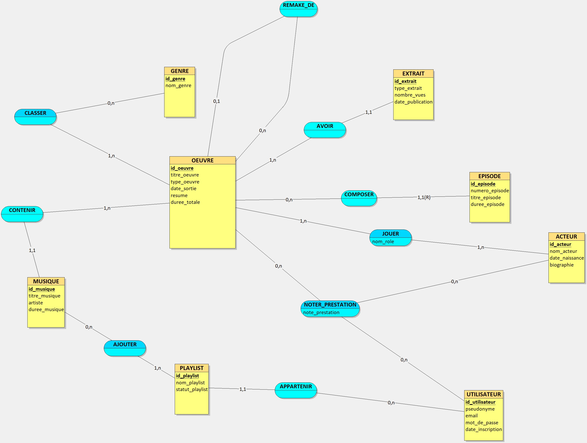

# ProjetDB_Kamdem_Graus

### Prompt final:
Tu travailles dans le domaine de la distribution et l’exploitation d’œuvres cinématographiques et télévisuelles coréennes et dans leurs original Sound Track mais également dans le divertissement.

Ton entreprise K-MusicDrama a comme activité de proposer des séries et films coréens (K-Drama), de pouvoir par la suite retrouver facilement les OST des séries ou films répertoriés sur la plateforme de streaming mais aussi la plateforme propose des extraits vidéos tendances attrayantes et/ou réminiscentes.

Elle permet également aux fans de créer des playlists et de noter les prestations des acteurs.

C’est une plateforme de streaming, comme Netflix, Viki, Disney+, VoirDrama ou Spotify, mais avec une approche originale : elle s’inspire des tendances TikTok grâce aux extraits vidéo populaires, et de Prime Video où, lorsqu’on met pause sur une série ou un film à un moment précis, la musique présente à cet instant apparaît, créant une expérience immersive.

Chez nous, le concept va encore plus loin : nous avons un onglet dédié qui répertorie toutes les OST de chaque film et série coréenne et un autre onglet dédié aux extraits tendances alléchantes ou nostalgiques.

Des données ont été collectées sur les séries (titres, dates), les épisodes, les acteurs (biographies), les musiques (titres, artistes), et les interactions des utilisateurs (notes, playlists).

Inspire-toi des sites suivant :
- https://www.nautiljon.com/dramas/
- https://mydramalist.com/recommendations/shows
- https://open.spotify.com/intl-fr
- https://www.soompi.com
- https://www.viki.com/?locale=fr
- https://www.netflix.com/fr/
- https://www.disneyplus.com/fr-fr

Ton entreprise K-MusicDrama veut appliquer MERISE pour concevoir un système d'information.

Tu es chargé de la partie analyse, c’est-à-dire de collecter les besoins auprès de l’entreprise. Elle a fait appel à un étudiant en ingénierie informatique pour réaliser ce projet, tu dois lui fournir les informations nécessaires pour qu’il applique ensuite lui-même les étapes suivantes de conception et développement de la base de données.

D’abord, établis les règles de gestions des données de ton entreprise K-MusicDrama, sous la forme d'une liste à puce. Elle doit correspondre aux informations que fournit quelqu’un qui connaît le fonctionnement de l’entreprise, mais pas comment se construit un système d’information.

Ensuite, à partir de ces règles, fournis un dictionnaire de données brutes avec les colonnes suivantes, regroupées dans un tableau : signification de la donnée, type, taille en nombre de caractères ou de chiffres. Il doit y avoir entre 25 et 35 données. Il sert à fournir des informations supplémentaires sur chaque donnée (taille et type) mais sans a priori sur comment les données vont être modélisées ensuite.

Fournis donc les règles de gestion et le dictionnaire de données.

### Résultats de l'IA :

RÈGLES DE GESTION

Gestion des œuvres (films & séries)

- Une œuvre peut être soit un film, soit une série coréenne.
- Chaque œuvre possède un titre, une date de sortie et un résumé.
- Une série est composée de un ou plusieurs épisodes.
- Un épisode appartient à une seule série.
- Chaque épisode possède un numéro et une durée.
- Une œuvre peut être associée à plusieurs genres.
- Une œuvre peut avoir plusieurs extraits vidéo.
- Un extrait vidéo est toujours rattaché à une seule œuvre.
- Un extrait peut être classé comme “tendance” ou “nostalgique”.
- Si type_oeuvre = "Film" → l'œuvre ne possède pas d’épisodes.
- Si type_oeuvre = "Série" → l’attribut duree_film est nul.

Gestion des acteurs

- Un acteur possède un nom, une date de naissance et une biographie.
- Un acteur peut jouer dans plusieurs œuvres.
- Une œuvre peut comporter plusieurs acteurs.
- Le rôle d’un acteur est précisé pour chaque œuvre.
- Les utilisateurs peuvent noter la prestation d’un acteur dans une œuvre donnée.

Gestion des musiques (OST)

- Une œuvre peut contenir plusieurs musiques (OST).
- Une musique est associée à une œuvre précise.
- Une musique possède un titre, un artiste et une durée.
- Toutes les musiques d’une œuvre sont regroupées dans un onglet dédié.
- Les utilisateurs peuvent consulter la liste complète des OST d’une œuvre.
- Les utilisateurs peuvent ajouter des musiques à leurs playlists personnelles.
- Une musique peut être présente dans plusieurs playlists.

Gestion des utilisateurs

- Un utilisateur doit créer un compte pour interagir avec la plateforme.
- Un utilisateur possède un pseudonyme, un email et un mot de passe.
- Un utilisateur peut créer plusieurs playlists.
- Une playlist appartient à un seul utilisateur.
- Une playlist peut être rendue publique ou privée.
- Un utilisateur peut noter une œuvre.
- La note d’une œuvre est comprise entre 1 et 5.
- Un utilisateur peut noter la prestation d’un acteur dans une œuvre.
- Les interactions des utilisateurs sont enregistrées (notes, playlists).

Gestion des extraits tendances

- Un extrait vidéo possède une date de publication.
- Le nombre de vues d’un extrait est enregistré.
- Les extraits peuvent être classés selon leur popularité.
- Les extraits sont consultables via un onglet dédié distinct des œuvres complètes.

Dictionnaire de données brutes – K-MusicDrama

| Signification de la donnée | Type | Taille |
|----------------------------|------|--------|
| Identifiant d’une œuvre | Numérique | 10 chiffres |
| Titre de l’œuvre | Texte | 150 caractères |
| Type d’œuvre (film ou série) | Texte | 10 caractères |
| Date de sortie de l’œuvre | Date | AAAA-MM-JJ |
| Résumé de l’œuvre | Texte | 2000 caractères |
| Durée d’un film (en minutes) | Numérique | 3 chiffres |
| Genre d’une œuvre | Texte | 50 caractères |
| Identifiant d’un épisode | Numérique | 10 chiffres |
| Numéro d’épisode | Numérique | 3 chiffres |
| Titre d’un épisode | Texte | 150 caractères |
| Durée d’un épisode (en minutes) | Numérique | 3 chiffres |
| Identifiant d’un acteur | Numérique | 10 chiffres |
| Nom complet de l’acteur | Texte | 100 caractères |
| Date de naissance de l’acteur | Date | AAAA-MM-JJ |
| Biographie de l’acteur | Texte | 3000 caractères |
| Nom du rôle interprété | Texte | 100 caractères |
| Identifiant d’une musique (OST) | Numérique | 10 chiffres |
| Titre de la musique | Texte | 150 caractères |
| Nom de l’artiste | Texte | 100 caractères |
| Durée de la musique (en secondes) | Numérique | 4 chiffres |
| Identifiant utilisateur | Numérique | 10 chiffres |
| Pseudonyme utilisateur | Texte | 50 caractères |
| Adresse email utilisateur | Texte | 150 caractères |
| Mot de passe utilisateur (hashé) | Texte | 255 caractères |
| Date d’inscription utilisateur | Date | AAAA-MM-JJ |
| Identifiant playlist | Numérique | 10 chiffres |
| Nom de la playlist | Texte | 100 caractères |
| Statut de la playlist (publique/privée) | Texte | 10 caractères |
| Note attribuée à une œuvre | Numérique | 1 chiffre |
| Note attribuée à une prestation d’acteur | Numérique | 1 chiffre |
| Identifiant d’un extrait vidéo | Numérique | 10 chiffres |
| Type d’extrait (tendance/nostalgique) | Texte | 20 caractères |
| Nombre de vues d’un extrait | Numérique | 9 chiffres |
| Date de publication d’un extrait | Date | AAAA-MM-JJ |

### MCD

